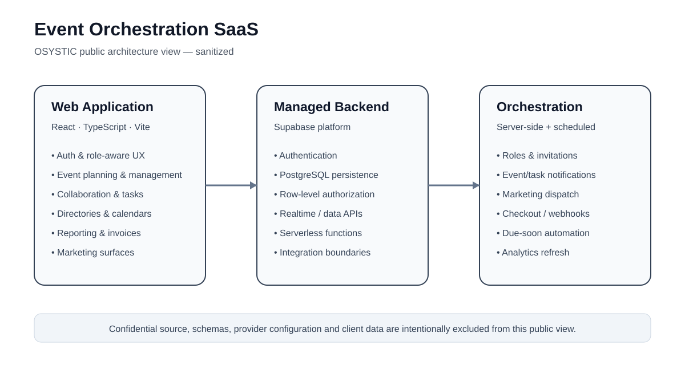
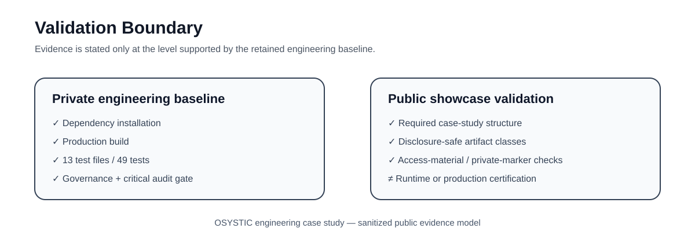

# Event Orchestration SaaS — Engineering Case Study

> **OSYSTIC ENGINEERING CASE STUDY · PUBLIC SHOWCASE · SANITIZED · PORTFOLIO-SAFE**
>
> Prepared under the **OSYSTIC public engineering showcase standard** for client, partner, technical-review, and portfolio use. This repository contains **no client identity, no confidential implementation source, no private database schema or migrations, no credentials, no private domains or project references, no commercial terms, and no private conversations**.



## Company showcase classification

| Attribute | Public classification |
|---|---|
| Publisher | **OSYSTIC** |
| Artifact type | Engineering case study / capability proof |
| Product category | Multi-tenant event-orchestration SaaS |
| Publication model | Sanitized public showcase with independent Git history |
| Confidential implementation | Excluded and retained privately |
| Production/live claim | Not asserted by this public repository |
| Intended use | Portfolio, proposals, technical due diligence, capability review |

This repository demonstrates product architecture, workflow orchestration, SaaS engineering, backend integration, validation discipline, and repository governance. It is **not** a source-code distribution of the confidential implementation.

## Project overview

The source project is a full-stack event-orchestration platform designed around the operational lifecycle of planning and coordinating events. The application surface includes authenticated planning workflows, event creation and management, team collaboration, project/task coordination, service directories, notifications, marketing workflows, reporting, invoices, and payment-related integration surfaces.

The engineering challenge was not simply to build individual screens. The system needed to coordinate user identity, permissions, event state, task state, collaboration, scheduled automation, transactional integrations, and backend workflows while keeping the application maintainable across a broad product surface.

## Product architecture

```text
Web application
React + TypeScript + Vite
        │
        ├── Authentication and role-aware navigation
        ├── Event creation and management
        ├── Collaboration, comments and invitations
        ├── Project / task / change workflows
        ├── Calendars, dashboards and progress views
        ├── Supplier / venue / hospitality / booking directories
        ├── Marketing and notification surfaces
        └── Reporting, invoices and payment flows
        │
        ▼
Backend platform
Supabase
        ├── Authentication
        ├── PostgreSQL data layer
        ├── Row-level access controls
        ├── Realtime / data APIs
        └── Serverless Edge Functions
              ├── role and invitation workflows
              ├── event / task notifications
              ├── marketing dispatch
              └── payment checkout / webhook processing
        │
        ▼
Operational automation
Scheduled GitHub Actions + provider integrations
```

## Engineering highlights

- **Broad SaaS workflow surface:** event planning, collaboration, project/task management, directories, notifications, reporting and payment-adjacent flows are coordinated within one application architecture.
- **Role-aware backend operations:** serverless workflows support role assignment, invitations and controlled user-management operations rather than placing privileged behavior in the browser.
- **Event-driven notifications:** event and task notification paths are separated into backend functions, supporting clearer security and operational boundaries.
- **Payment integration boundary:** checkout and webhook responsibilities are kept server-side, with the public case study deliberately excluding implementation and configuration details.
- **Scheduled operational workflows:** recurring marketing-summary, due-soon and analytics-refresh automation demonstrates orchestration beyond request/response UI flows.
- **Typed frontend architecture:** React, TypeScript, routing, form validation, component primitives, charting and drag-and-drop capabilities support a complex operational UI.
- **Validation discipline:** the retained private engineering baseline passes dependency installation, production build and unit tests; repository governance and critical dependency checks are also enforced.
- **Repository consolidation:** duplicate historical repositories were reconciled into one canonical private source without importing unsafe legacy history or generated repository noise.

## Technology

`React` · `TypeScript` · `Vite` · `Tailwind CSS` · `Radix UI / component primitives` · `React Router` · `React Hook Form` · `Zod` · `Supabase Auth` · `PostgreSQL` · `RLS` · `Edge Functions` · `Realtime` · `Stripe integration` · `Recharts` · `Vitest` · `GitHub Actions`

## Capability keywords

`saas` · `event-management` · `workflow-orchestration` · `react` · `typescript` · `supabase` · `serverless` · `postgresql` · `role-based-access` · `notifications` · `payments` · `automation` · `testing` · `github-actions`

## Validation boundary

The confidential engineering repository is the implementation source of truth. During repository standardization, its maintained baseline recorded:

- dependency installation: **PASS**;
- production build: **PASS**;
- unit tests: **PASS — 13 test files / 49 tests**;
- governance / repository-safety checks: **PASS**;
- critical-severity dependency audit gate: **PASS at the consolidation baseline**.

The source project also has recorded pre-existing lint and dependency-maintenance debt. This public showcase therefore does **not** claim a zero-debt codebase or independently prove a live production deployment. See [Validation evidence](docs/validation-evidence.md).



## Public vs. private repository boundary

| Area | This public showcase | Confidential engineering repository |
|---|---|---|
| Visibility | **Public** | **Private** |
| Purpose | Portfolio / capability proof | Engineering source of truth |
| Application source | **Not included** | Controlled/private |
| Database schema and migrations | **Not included** | Controlled/private |
| Edge Function implementation | **Not included** | Controlled/private |
| Deployment configuration | **Not included** | Controlled/private |
| Client identity / private domains | **Not included** | Controlled/private |
| Credentials / provider references | **Not included** | Controlled/private/governed |
| Commercial information | **Not included** | Controlled/private |
| Safe to share publicly | **Yes** | **No** |

This repository is not a fork, mirror, or source export. It has **independent Git history** and contains only sanitized documentation and diagrams.

## Repository-hardening outcome

A later governance review found two historical repositories carrying substantially the same application state. The safe consolidation strategy was to preserve the authoritative implementation in one canonical private repository while intentionally excluding generated build output, duplicate dependency locks, local tool state, nonessential automation, and a legacy deployment workflow that should not be propagated.

The lesson is important for engineering governance: **repository consolidation is not the same thing as blindly merging Git histories**. Security provenance, generated state, authority, and maintainability must be evaluated before data is retained. See [Repository hardening](docs/repository-hardening.md).

## What is intentionally not claimed

This showcase does **not** claim:

- access to the confidential source code through this repository;
- that the public repository can be deployed as the original application;
- a specific client identity, business domain or production URL;
- uninterrupted production uptime, SLA or audited compliance certification;
- zero technical debt in the retained private implementation;
- PCI certification or direct handling of raw card details;
- that every historical prototype or deployment artifact remains authoritative;
- unrestricted redistribution rights for this case-study content.

## Read more

- [Full case study](case-study.md)
- [Product capabilities](docs/product-capabilities.md)
- [Technical overview](docs/technical-overview.md)
- [Engineering decisions](docs/engineering-decisions.md)
- [Validation evidence](docs/validation-evidence.md)
- [Repository hardening](docs/repository-hardening.md)
- [Lessons learned](docs/lessons-learned.md)
- [Disclosure boundary](docs/disclosure-boundary.md)
- [Standardization acceptance](docs/standardization-acceptance.md)
- [Publication and reuse notice](NOTICE.md)

## Publication and reuse

This is an **OSYSTIC public engineering case study**, not an open-source delivery repository. Public visibility permits viewing, linking, and citation of the showcase; it does not grant unrestricted rights to copy, repackage, white-label, resell, or republish substantial content or diagrams. See [NOTICE.md](NOTICE.md) for the publication and reuse boundary.
